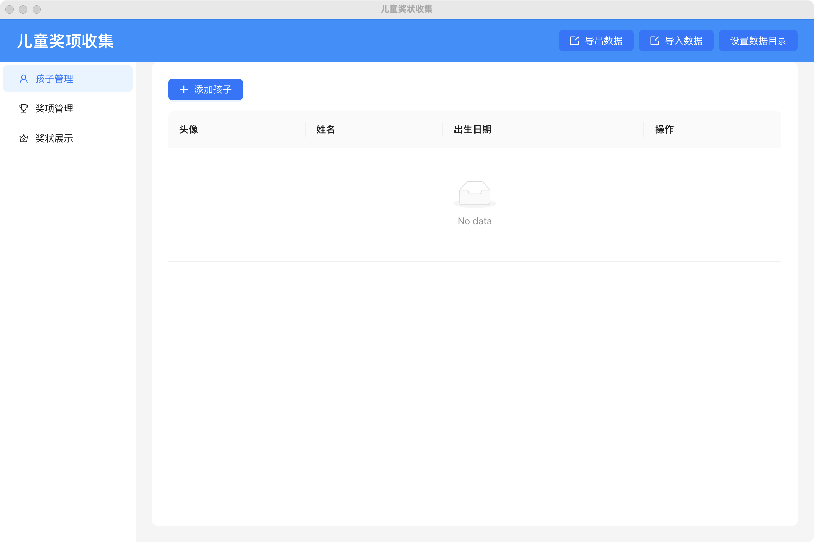

# 儿童奖项收集系统


基于 Electron 的跨平台桌面应用，用于管理儿童获奖信息与奖状展示

## 主要功能



### 核心功能

- 👦 孩子信息管理：增删改查儿童档案（姓名、年龄、头像等）
- 🏆 奖项管理：支持奖项分类、获奖时间记录、证书图片上传
- 🖼️ 可视化展示墙：时间轴展示获奖记录，支持按儿童/时间/年龄筛选

### 数据管理

- 📁 本地数据存储：使用 Electron Store 实现数据持久化
- 🔄 导入/导出：支持 JSON 格式数据迁移
- ⚙️ 自定义数据目录：可配置存储路径，图片会根据奖项对应时间分类存储


## 技术栈

### 核心框架

- **Electron 25** - 跨平台桌面应用框架
- **React 18** + **Vite 4** - 前端架构
- **TypeScript 5** - 类型安全开发

### 主要依赖

- `electron-builder` - 安装包构建
- `antd 5` - UI 组件库
- `dayjs` - 日期处理

### 工程化

- **ESLint** + **Prettier** - 代码规范
- **Git Hooks** - 提交校验
- **pnpm** - 包管理
- **electron-store** - 本地数据存储

## 开发环境

### 安装依赖

```bash
pnpm install
```

### 启动开发模式

```bash
pnpm dev
```

### 构建安装包

```bash
pnpm build
```

## 项目结构

├── electron/ 主进程代码

├── src/ 渲染进程组件

├── types/ 类型定义

├── dist-electron/ 编译后的主进程代码

└── release/ 构建产物目录
